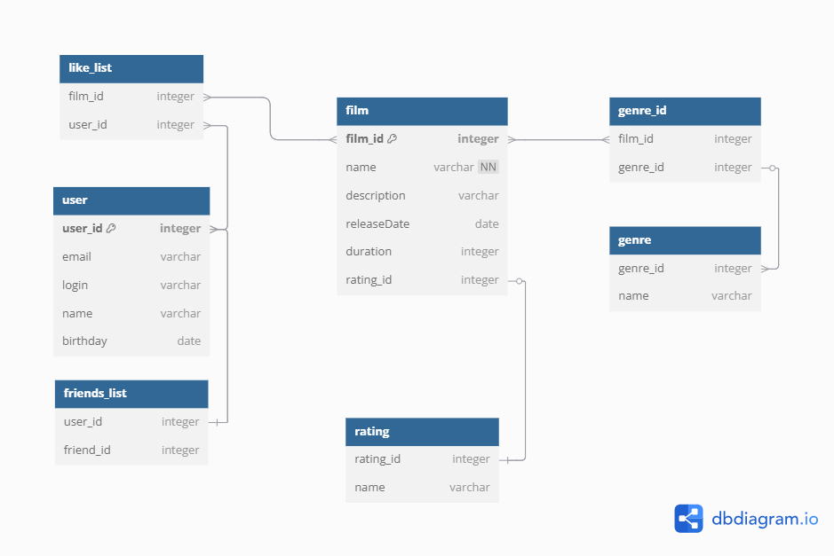

# java-filmorate
## Промежуточное задание 12 спринта, составление ER диаграммы 

Получение списка фильмов:
SELECT name,
       dexcription,
       releaseDate,
       duration
FROM film;

Получение топ 10 списка фильмов по лайкам:
SELECT film.*,
       COUNT(ll.user_id) AS likes_count
FROM film
JOIN like_list AS ll ON film.film_id = ll.film_id
GROUP BY film.id
ORDER BY likes_count DESC
LIMIT 10;

Получение списка друзей пользователя: 
SELECT u.*,
       COUNT(fl.friends_list)
FROM USER AS u
JOIN friends_list AS fl ON u.user_id = fl.user_id

